# Wheelchair User Detection in Street Imagery

**Object detection with YOLOv8 · Two independent hyperparameter search strategies, compared under controlled conditions**

Applied Computer Vision · AI & Deep Learning · Reichman University

**Team:** Emma Weinstein · Tal Matsil · Tamar Telele

---

## 1. Project Summary

Accessibility planning depends on manual street surveys that are expensive and infrequent. This project fine-tunes a YOLOv8 detector that **finds and counts wheelchair users in street photographs**, turning a periodic survey into a measurement that can be repeated cheaply and used to direct infrastructure budgets by evidence.

The task is **localisation, not classification**: knowing *where* and *how many* is what makes the output actionable.

### Classes

| Class | Meaning |
|---|---|
| `people_wheelchair` | A person **together with** a chair — treated as one object. The deployment target. |
| `person` | A pedestrian with **no** mobility aid. Context class. |
| `wheelchair` | An **unoccupied** wheelchair. |

The taxonomy is deliberately adversarial: `people_wheelchair` and `person` show the same body from the same angles, differing only by a chair that is frequently occluded by its occupant. Separating them is exactly the capability the use case needs, which is why the project's **primary metric is F1 on `people_wheelchair`** rather than aggregate mAP.

### Headline result

The selected model reaches **F1 = 0.946** on `people_wheelchair` and **mAP@0.5 = 0.968** on `wheelchair` on a held-out test split it had never seen, at **~30 ms per image** on a Tesla T4.

### Three principles that govern the whole notebook

1. **Measure before you train.** EDA findings removed `imgsz=1280` and vertical flips from the search space before a single GPU hour was spent.
2. **The test split is touched exactly once.** Every decision — configuration, architecture, confidence threshold — is made on validation. The test split is measured once, at the very end.
3. **The primary metric is F1 on `people_wheelchair`.** Under a 4.8 : 1 class imbalance, aggregate mAP is dominated by `person`, the class the project cares least about.

---

## 2. Repository Structure

```
.
├── README.md
├── requirements.txt
├── Final_Version.ipynb                          # main notebook — end-to-end pipeline
├── experiments/                                 # supporting notebooks, run before the final one
│   ├── ModelAHyperParameterSearchPipeline.ipynb # Model A: sequential per-hyperparameter search (§4.2)
│   ├── ModelBHyperParameterSearchPipeline.ipynb # Model B: Successive Halving search (§4.2)
│   ├── dataset_qc.ipynb                         # dataset audit that drove the cleaning rounds (§3.3)
│   └── error_analysis_dataset_qc.ipynb          # label re-audit of the test split (§6)
└── assets/                                      # figures used in this README
    ├── data_integrity.png
    ├── class_distribution.png
    ├── dataset_gallery.png
    ├── modelA_curves.png · modelA_metrics.png
    ├── modelB_curves.png · modelB_metrics.png
    ├── ab_comparison.png · ab_perclass.png
    ├── model_selection.png · conf_calibration.png · iou_calibration.png
    ├── speed_vs_accuracy.png
    ├── test_metrics.png · test_predictions.png
    ├── error_analysis.png · missed_by_size.png
    ├── gallery_00_key.png · gallery_07_crowding.png
    └── gallery_sheet_*.png                      # 5 contact sheets, one per failure mode
```

**Main notebook:** `Final_Version.ipynb` — runs the full pipeline: download → integrity checks → EDA → train A → train B → compare → calibrate → test → error analysis → error gallery.

**Trained weights are not committed.** The notebook writes them to `runs/detect/Model_A_best/weights/best.pt` and `runs/detect/Model_B_best/weights/best.pt`; re-running §8 reproduces them.

**Open in Colab:** [](https://colab.research.google.com/github/Emma-V/cv-group-project/blob/main/Final_Version.ipynb)

---

## 3. Dataset Description

### Source and licence

| | |
|---|---|
| Platform | Roboflow — `first-group-project / wheelchair-9qvfx-bchvo`, **version 5** |
| Dataset page | https://universe.roboflow.com/first-group-project/wheelchair-9qvfx-bchvo/dataset/5 |
| Licence | CC BY 4.0 |
| Annotation format | YOLO `.txt` (one row per box: `class xc yc w h`, normalised) |
| Export preprocessing | Auto-Orient applied · Resize (stretch) to 640 × 640 |

### We did not train on the raw download

The public dataset was forked into an independent copy and cleaned over several rounds **before a single epoch was trained**:

1. **Background images added** — images containing no objects, so the model can learn that "nothing here" is a valid answer (9 in train, 3 in valid, 1 in test).
2. **Annotation correction** — mislabelled boxes were identified and fixed by hand. The dominant problem was crowd scenes where most pedestrians had never been labelled at all; those images were either re-annotated or removed.
3. **Model-in-the-loop QA** — an early throwaway model was trained purely to produce a ranked list of its own failures, which was then used as a search beam to surface remaining annotation errors that a manual pass had missed.
4. **Automated integrity checks** — duplicates, cross-split leakage, and label ambiguity (§3.3).

This process is the single most consequential part of the project: the first models scored poorly on `person` not because of the architecture but because the ground truth was wrong.

### 3.1 Splits

| Split | Images | Objects | Backgrounds |
|---|---:|---:|---:|
| Train | 1,101 | 2,834 | 9 |
| Validation | 236 | 574 | 3 |
| Test | 236 | 570 | 1 |
| **Total** | **1,573** | **3,978** | **13** |

Split ratio ≈ 70 / 15 / 15.

### 3.2 Class balance

| Class | Objects | Share | Train | Valid | Test | Inverse-frequency weight |
|---|---:|---:|---:|---:|---:|---:|
| `person` | 2,596 | 65.3 % | 1,867 | 355 | 374 | 0.332 |
| `people_wheelchair` | 843 | 21.2 % | 578 | 141 | 124 | 1.073 |
| `wheelchair` | 539 | 13.5 % | 389 | 78 | 72 | 1.595 |

The imbalance is **≈ 4.8 : 1**. Per-split shares track closely (`person` 62–66 %, `wheelchair` 13–14 %), confirming the splits are stratified rather than skewed.

**How the imbalance was handled.** Rather than duplicating rare-class data, it was corrected in the loss. Inverse-frequency weights were computed from the training split and normalised to mean 1.0. Ultralytics exposes a single scalar `cls` for the classification loss rather than a per-class vector, so the **mean minority weight, `cls = 1.334`**, was applied — derived from the data, and applied **identically to both models** so that the imbalance fix cannot confound the A-vs-B comparison.

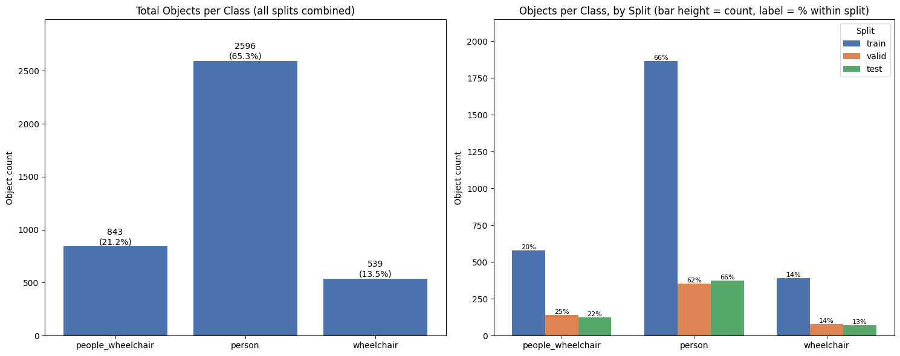

### 3.3 Data integrity validation

| Check | Method | Result |
|---|---|---|
| Exact duplicates | MD5 hash over image bytes | **0 groups** |
| Train ↔ Test leakage (exact) | MD5 cross-split comparison | **0 images** |
| Train ↔ Test leakage (near) | Perceptual hash (`imagehash.phash`) | **0 near-duplicates** |
| Label ambiguity | Pairwise cross-class IoU, 1,606 pairs | **2 pairs > 0.5** (0.12 %), median IoU 0.0000 |

Filename comparison is worthless on a Roboflow export — augmented copies are emitted under different names — so leakage is checked at **byte level and perceptually** instead. Both returned zero, which is what licenses the claim that the test score in §5 measures generalisation rather than memorisation.

The cross-class IoU test rules out annotation ambiguity **in advance** as an explanation for any weak class — a hypothesis the error analysis in §5.5 revisits and rejects on independent evidence.

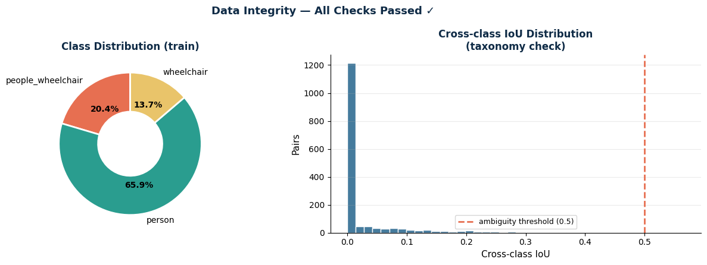

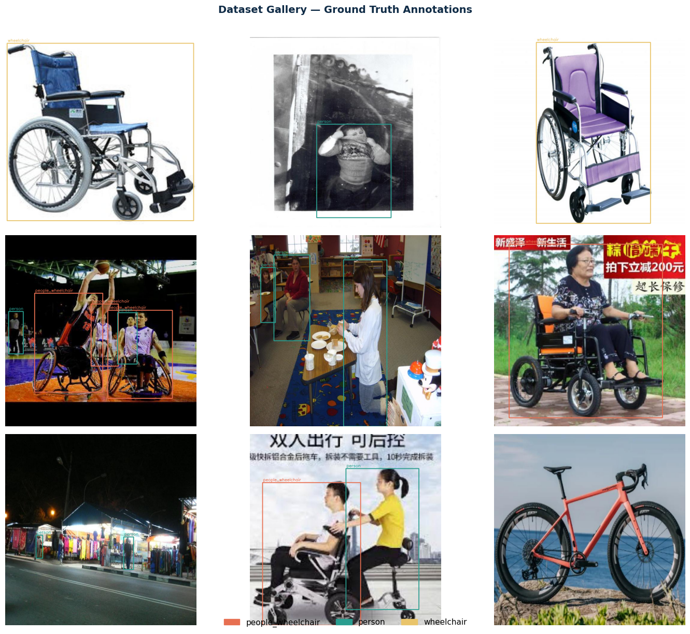
*Random sample of training images with ground-truth boxes. Boxes align with the intended objects and the three class colours stay visually separable across typical street scenes.*

### 3.4 Augmentation

Applied through the Ultralytics pipeline (`data.yaml` + `model.train()` arguments), not custom code. Two regimes were used, one per model:

| Parameter | Model A — "strong" | Model B — "mild" |
|---|---:|---:|
| `hsv_h` / `hsv_s` / `hsv_v` | 0.05 / 0.7 / 0.5 | 0.010 / 0.4 / 0.3 |
| `translate` | 0.05 | 0.10 |
| `scale` | 0.7 | 0.30 |
| `fliplr` | 0.5 | 0.5 |
| `flipud` | **0.0** | **0.0** |
| `mosaic` | 1.0 | 0.5 |
| `mixup` | 0.1 | 0.0 |
| `copy_paste` | 0.5 | 0.0 |
| `degrees` / `shear` / `perspective` | 0.0 | 0.0 |
| `close_mosaic` | 10 (last 10 epochs) | 10 (last 10 epochs) |

Two augmentation decisions were driven by the EDA rather than by convention:

- **`imgsz` stayed at 640** — only ~4 % of boxes are small, so 1280 would have cost roughly 4× the GPU time to address a small minority of the objects.
- **Vertical flipping was disabled (`flipud = 0`)** — an upside-down wheelchair never occurs in deployment, so training on one spends capacity on a distribution that will never be evaluated.

---

## 4. Model and Methods

### 4.1 Transfer learning setup

**Backbone:** YOLOv8 pretrained on COCO (`yolov8m.pt` / `yolov8s.pt`), fine-tuned on the three project classes. The detection head is re-initialised for `nc = 3`; Ultralytics remaps the COCO `person` row into the new head by class name, so one of the three classes starts from a pretrained classifier row.

**Freeze / unfreeze:** treated as a searched variable, not a fixed choice. Model A converged on a two-phase schedule (`freeze = 10` — the first 10 backbone modules held fixed); Model B's search found that single-stage training with a fully unfrozen backbone (`freeze = 0`) was better for the smaller architecture.

### 4.2 Two searches, by design

Rather than running one hyperparameter search, we ran **two independent searches following opposite philosophies** and treated the resulting models as candidates in a controlled selection. Both searches used the **validation split only**.

#### Model A — sequential, one variable at a time

Every run changes exactly one hyperparameter, so any difference in outcome has exactly one cause. The trajectory of experiments *is* the explanation of the final recipe.

| # | Change | Outcome / decision |
|---|---|---|
| Base | `yolov8s`, 30 ep | Pipeline verified before committing to long runs |
| 1 | `copy_paste = 0.4` | Upgrade to `yolov8m`; rare classes improve |
| 2 | `copy_paste = 0.5` | No further gain → parameter saturated |
| 3 | `cls = 0.8` | Confusion matrix showed class errors → helps |
| 4 | `cls = 1.0` | Worse → optimum bracketed at 0.8 |
| 5 | `freeze 10 → 0` | Two-phase transfer learning; **exposed a bug** |
| 6 | `SGD, lr0 = 0.001` | First run where `lr0` was genuinely applied |
| 7 | `lr0 = 0.0005` + `cos_lr` | Smoother late convergence |
| 8 | `mixup`, `scale`, HSV | Target the residual recall gap |

Selection was **not narrative**: a dedicated cell re-evaluated every run that produced a checkpoint on validation under identical inference settings and picked the winner from that table automatically.

> **What the sequential discipline caught.** Experiment 5's logs revealed that `optimizer="auto"` — the Ultralytics default — **silently overrides any `lr0` passed to it**. Every earlier run had been sweeping a parameter that was never applied. A broad random search would have absorbed this as noise.

#### Model B — Successive Halving over 32 random configurations

Nine hyperparameters at ~30 min per run make exhaustive search impossible. Random search covers more distinct values per axis than a grid on the same budget (Bergstra & Bengio, 2012); Successive Halving then runs everything briefly and keeps the better half (Jamieson & Talwalkar, 2016).

| Stage | What happened | Outcome |
|---|---|---|
| A | 32 configs → 16 → 8, 5 ep/rung | 6 survivors |
| Audit | Spearman ρ, rung-1 vs rung-3 ranking | **ρ = 0.07** vs ~0.70 threshold |
| Rescue | Eliminated configs re-run at 15 ep | 5 of 6 beat all survivors |
| B1 | Top-6 fully retrained, 40 ep | A27 wins (0.8809) |
| B2 | A27 fixed; 5 architectures compared | `yolov8s` wins |
| C1 | lr re-swept ×0.5 / ×1 / ×2 | ×0.5 → 5.17e-05 |
| C2 | `freeze 10→0` vs single-stage | Single-stage wins |
| C3 | Two seeds on the final recipe | **0.8899 ± 0.0017** |

> **The audit and its consequence.** Spearman ρ = 0.07 showed that five-epoch scores were nearly uninformative on this data — the early rungs were ranking noise. Rather than discard the finding, eliminated configurations were re-evaluated at a longer budget, and additional strong candidates were recovered. **Without the audit the eventual winner would have been discarded at rung 1.** GPU-time constraints meant not all rescued candidates could be retrained in full; the fastest-converging winner (A27) was carried forward under progressively stricter filtering — a deliberate exploration-vs-runtime trade-off.

### 4.3 Final recipes

| | **Model A** | **Model B** |
|---|---|---|
| Backbone | YOLOv8m — 25.9 M params, 79.1 GFLOPs | YOLOv8s — 11.1 M params, 28.6 GFLOPs |
| Optimizer | SGD, `lr0 = 0.001`, momentum 0.937 | Adam, `lr0 = 5.168e-05` |
| Weight decay | 0.00133 | 0.00133 |
| Schedule | `cos_lr`, `warmup_epochs = 0` | `cos_lr`, `warmup_epochs = 0` |
| Freeze | `freeze = 10` | `freeze = 0` |
| Augmentation | strong (mixup 0.1, copy_paste 0.5) | mild (mosaic 0.5) |
| Batch / imgsz | 16 / 640 | 16 / 640 |
| Epochs | 80 budget, **early-stopped at 57** (best epoch 27) | 80, **all completed** |
| `cls` weight | 1.334 | 1.334 |
| Training time | 0.446 h (~27 min) | 0.518 h (~31 min) |

**Experimental controls.** Same data, same global seed (42) re-applied immediately before *each* `train()` call, same class weight, same image size, same epoch budget, same early-stopping patience, same hardware. Only the search strategy differs — which is precisely what the experiment set out to study.

**Environment:** Google Colab · NVIDIA Tesla T4 (15 GB) · Ultralytics 8.4.117 · PyTorch 2.11.0+cu128 · Python 3.12.13 · AMP enabled.

---

## 5. Results and Plots

### 5.1 Training behaviour

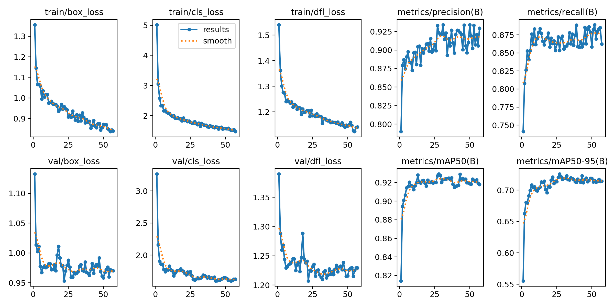
*Model A (YOLOv8m, SGD). Best checkpoint at epoch 27; early stop at 57.*

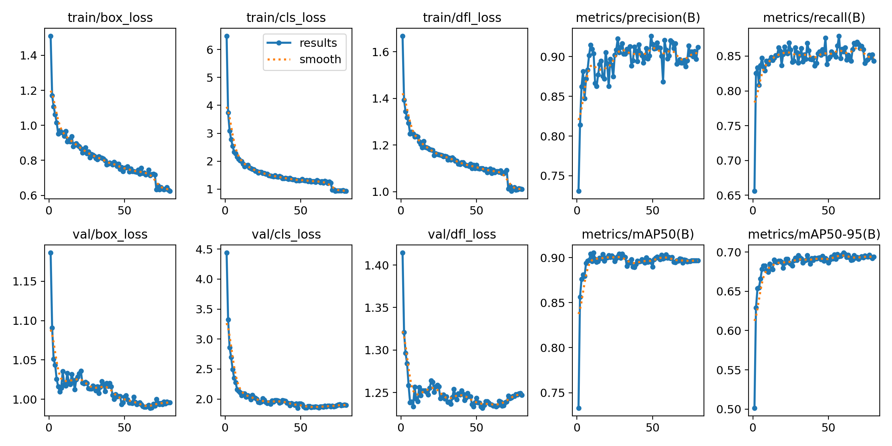
*Model B (YOLOv8s, Adam). Full 80 epochs; sharp train-loss drop at ~epoch 70 when `close_mosaic` disables mosaic augmentation.*

**Neither model shows classical overfitting.** Validation losses flatten rather than turning upward, and mAP holds a plateau instead of degrading. What *is* present is a **train–validation gap**: training loss keeps falling after validation has stalled, sharply so once mosaic is disabled near epoch 70.

That is **saturation, not a U-shaped overfit curve**, and Model A's early stop at epoch 57 was the correct response to it. The honest claim is *"no harmful overfitting on validation"* — not *"perfect generalisation"*.

### 5.2 Validation comparison — A vs B

| Metric | Model A | Model B |
|---|---:|---:|
| mAP@0.5 | **0.9267** | 0.8997 |
| mAP@0.5:0.95 | **0.7244** | 0.6976 |
| Precision | **0.9391** | 0.8967 |
| Recall | 0.8536 | **0.8565** |

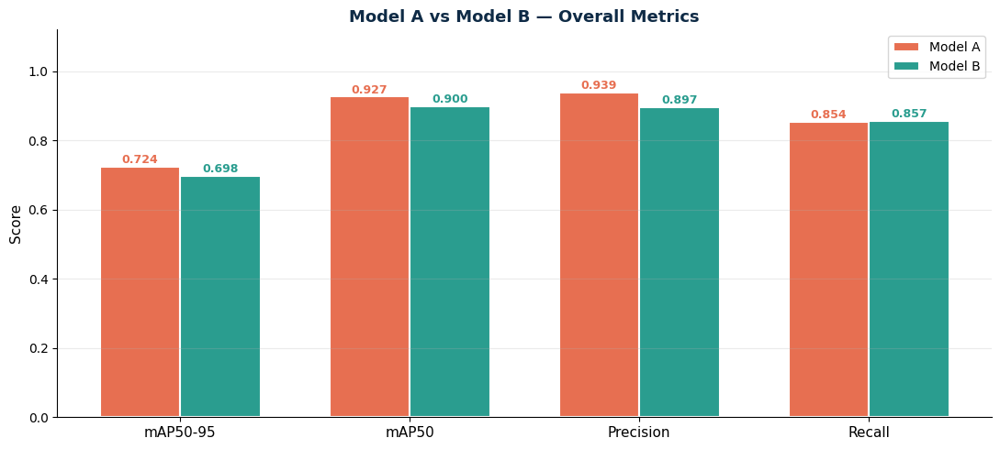

Per-class, on validation:

| Class | A · mAP50 | B · mAP50 | A · mAP50-95 | B · mAP50-95 |
|---|---:|---:|---:|---:|
| `people_wheelchair` | 0.955 | 0.945 | 0.769 | 0.747 |
| `person` | 0.835 | 0.775 | 0.506 | 0.445 |
| `wheelchair` | 0.990 | 0.980 | 0.898 | **0.901** |

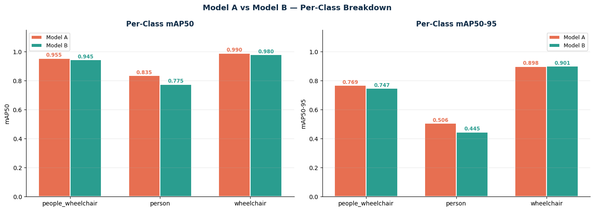

**The aggregates say A wins; the per-class view says something more useful.** On the two classes the project exists to detect the models are effectively tied — and B is marginally ahead on the stricter metric for the empty chair. The entire aggregate gap lives in `person`. Read correctly this is not *"A is better"* but *"A is better at crowded pedestrians, and neither model has solved them."*

### 5.3 Speed vs accuracy

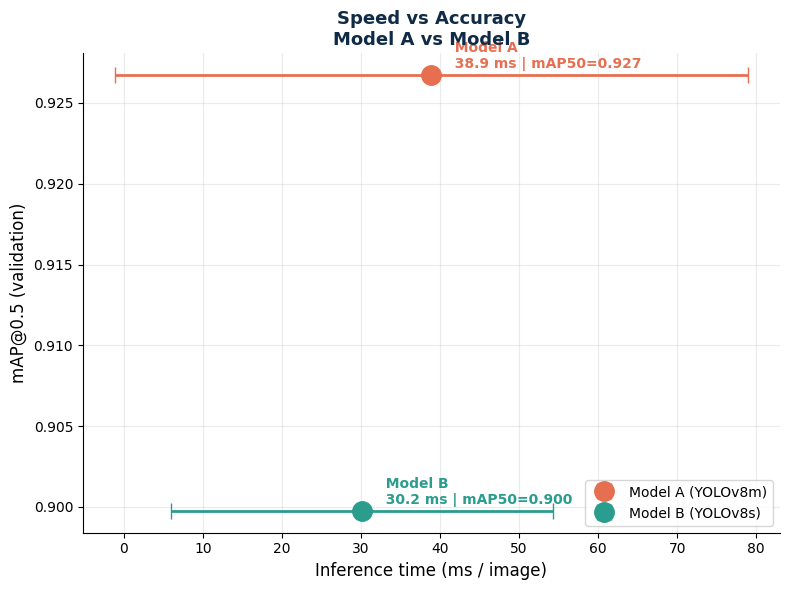

End-to-end `predict()` latency over 50 validation images, Tesla T4:

| Model | Latency (ms/image) | mAP@0.5 | Parameters |
|---|---:|---:|---:|
| A — YOLOv8m | 38.9 ± 40.1 | 0.9267 | 25.9 M |
| B — YOLOv8s | **30.2 ± 24.2** | 0.8997 | **11.1 M** |

*(Pure forward-pass time as reported by Ultralytics during validation is 10.7 ms for A and 4.5 ms for B; the figures above include pre- and post-processing and are the honest per-image cost.)*

**Neither model occupies the ideal top-left corner** — there is no single winner that is both faster and more accurate, only a trade-off. B is also markedly more stable in latency, which matters more than mean latency for any system with a frame budget.

### 5.4 Model selection, calibration, and test results

**Selection criterion.** Aggregate mAP is the wrong instrument under a 4.8 : 1 imbalance — it is dominated by `person`, the class of least interest. Selection used **F1 on `people_wheelchair`, on validation only**. F1 rather than recall, because recall alone is trivially maximised by a model that labels everything.

| Model | Precision | Recall | **F1** |
|---|---:|---:|---:|
| A | 0.9739 | 0.8865 | 0.9282 |
| **B — selected** | 0.9483 | 0.9112 | **0.9294** |

**Model B was selected — by 0.0012.** That margin is *inside run-to-run noise*: B's own seed-stability study measured ± 0.0017. The defensible reading is that the two searches **converged to equivalent performance on the class that matters**, and the tie is broken on secondary grounds — B is 2.3× smaller, faster, and far more stable in latency. The models reach parity by different routes: A through precision (0.974), B through recall (0.911), and for this use case recall is the more valuable half.

**Calibration.** `conf` and NMS-IoU are *inference* parameters, so they were swept on validation after training rather than searched as training axes — minutes instead of GPU-hours.

| Parameter | Swept range | Chosen | Ultralytics default |
|---|---|---:|---:|
| Confidence threshold | 0.05 → 0.75 | **0.45** | 0.25 |
| NMS IoU threshold | 0.30 → 0.80 | **0.45** | 0.70 |

Both differ from the library defaults, which are tuned for COCO.

<p align="center">
  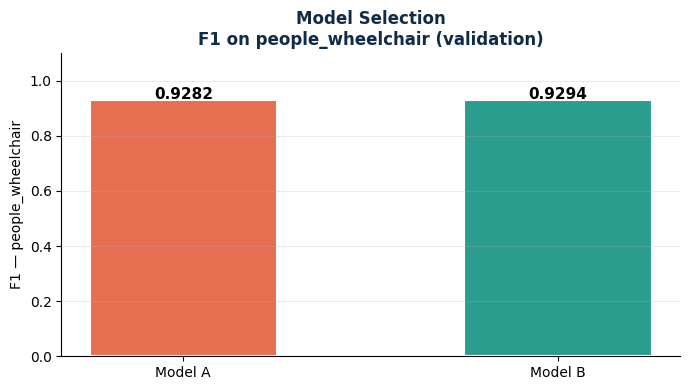
  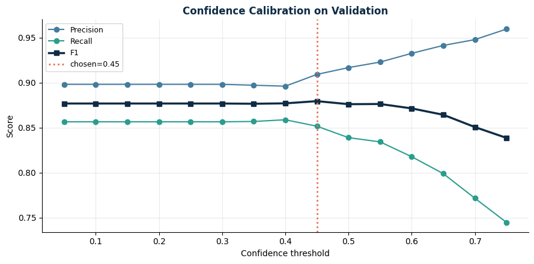
  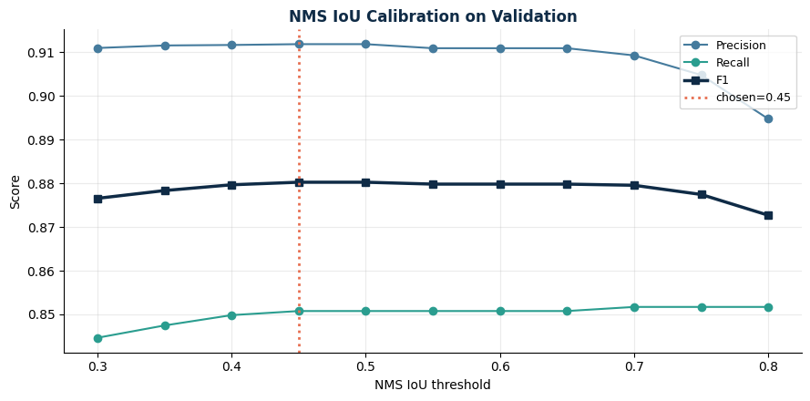
</p>

*Left: selection on F1 for `people_wheelchair`. Centre and right: the two calibration sweeps on validation. Note that F1 is almost flat across the confidence sweep — precision and recall trade off against each other cleanly, and 0.45 wins by a small margin.*

**Final test results** — Model B, `conf = 0.45`, `iou = 0.45`, 236 images / 570 objects, **the test split's only use in the entire project**:

| Class | Precision | Recall | F1 | mAP@0.5 | mAP@0.5:0.95 |
|---|---:|---:|---:|---:|---:|
| `people_wheelchair` | 0.9744 | 0.9194 | **0.9461** | 0.9143 | 0.7437 |
| `person` | 0.8441 | 0.6658 | 0.7444 | 0.6334 | 0.3778 |
| `wheelchair` | 0.9589 | 0.9722 | **0.9655** | 0.9681 | 0.8699 |
| **Macro average** | **0.9258** | **0.8525** | **0.8853** | **0.8386** | **0.6638** |

Inference cost on test: 1.5 ms preprocess + **9.6 ms inference** + 1.5 ms postprocess per image (Tesla T4).

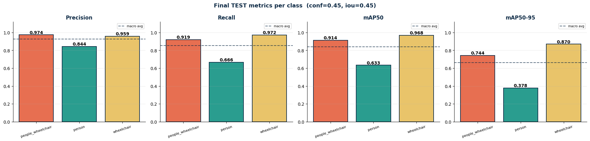

**Example predictions on the test split:**

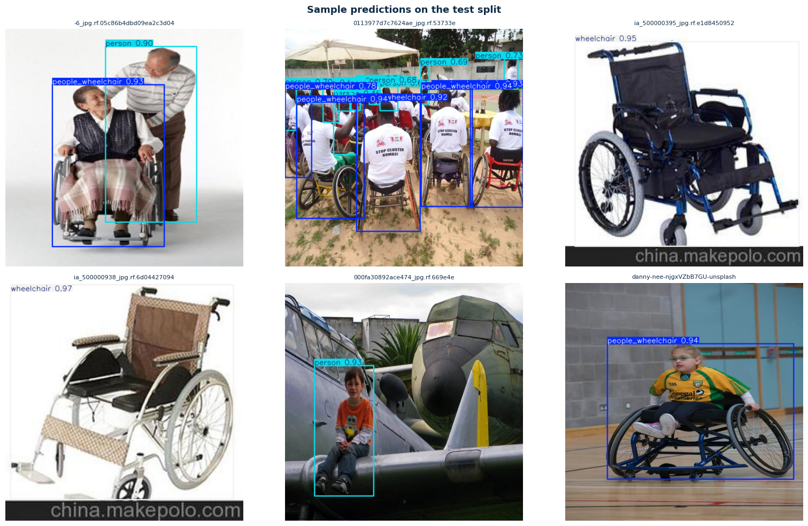

**The result splits along the axis the project cares about.** `wheelchair` is close to solved. `people_wheelchair`, the deployment target, holds F1 = 0.946 at recall 0.919 — roughly nineteen of every twenty wheelchair users are found. `person` is the weak point: precision (0.844) far exceeds recall (0.666), so the model is *not inventing pedestrians — it is failing to see about a third of them.*

### 5.5 Error analysis

Every test prediction was classified into TIDE-style categories (Bolya et al., ECCV 2020), converting *"the model is wrong"* into a diagnosis.

| Category | Count | % of errors |
|---|---:|---:|
| correct | 439 | — |
| **missed** | **131** | **70.4 %** |
| localization | 36 | 19.4 % |
| background (false positive) | 12 | 6.5 % |
| classification | 7 | 3.8 % |
| duplicate | 0 | 0.0 % |

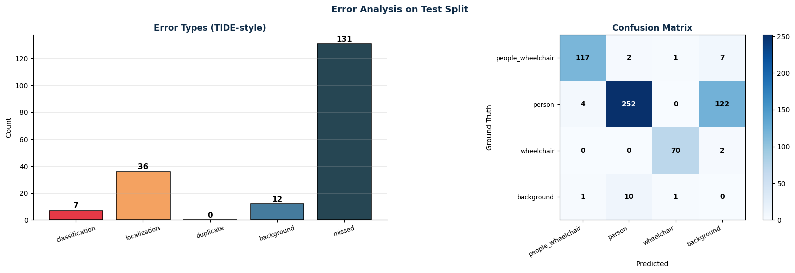

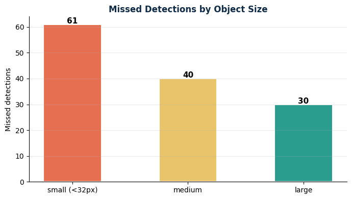

**70.4 % of errors are missed detections**, and the confusion matrix localises them precisely: **122 of the 131 misses are `person` predicted as background** — essentially the entire recall gap sitting in one cell.

This **eliminates both intuitive explanations**:

- **Not label ambiguity.** Cross-class confusion totals 7 errors across the whole test split (`person`→`people_wheelchair`: 4, `people_wheelchair`→`person`: 2, `people_wheelchair`→`wheelchair`: 1), and only 2 images show a `person` ↔ `people_wheelchair` prediction overlap.
- **Not NMS suppression.** Duplicates are zero.

The model is not confusing the classes — **it is not seeing the objects.**

**Size is a contributor, not the cause:** 46.6 % of misses are small (< 32 px), leaving 53.4 % at medium or large. The stronger signal is **crowding** — 54 images show a person-count mismatch, the worst carrying 30 errors (32 labelled people vs 15 detected). The model locks onto the subject of the photograph and drops the crowd behind it.

**There is headroom.** 12 background false positives against 131 misses means confidence can be lowered to convert misses into detections at little precision cost.

### 5.6 Error gallery — qualitative examples

The notebook produces **36 slide-ready figures**, one per failure mode, each showing the *same crop twice* — left: what the human labelled, right: what the model output — zoomed to the object under discussion. Re-running the final cells regenerates all 36 (and the `error_gallery.zip` bundle); the two figures reproduced below plus five per-mode contact sheets (`assets/gallery_sheet_*.png`) are committed here.

| Figure | Failure mode | What it shows |
|---|---|---|
| `00_key` | — | How to read every figure that follows |
| `01_missed` | Miss | A labelled object the model never detected |
| `02_background` | Ghost | The model invented an object out of background |
| `03_classification` | Class confusion | Right box, wrong label |
| `04_localization` | Sloppy box | Right object, IoU below 0.50 |
| `05_duplicate` | Duplicate | *(none found in the test split)* |
| `06_suspect_label` | **Suspect label** | The **dataset** looks wrong, not the model |
| `07_crowding` | Crowding | Whole frame, labelled count vs detected count |

Selection is driven by **legibility over difficulty** (the hardest image is the least readable one) and **variety over ranking** (candidates are bucketed by scene density × object size × class and picked round-robin, so six examples span solo shots and crowds, small and large objects, and all three classes).

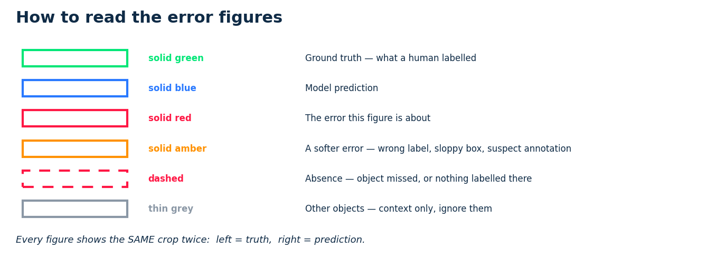

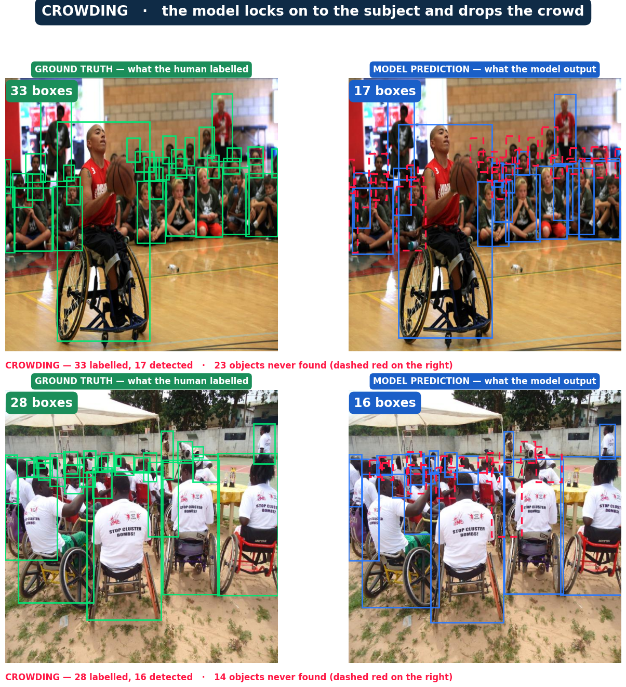
*Crowding — the single figure that carries the recall argument. Left: what the human labelled. Right: what the model output, with never-detected objects marked by dashed red boxes. The model locks onto the subject of the photograph and drops the crowd behind it.*

---

## 6. Limitations and Known Issues

**Some counted "errors" are annotation errors, not model errors.** The `suspect_label` pass surfaced **6 candidates on the test split** where the model's output is correct and the ground truth is wrong — the same object carrying two labels, or a labelled box that no prediction touches in an image the model otherwise handled confidently. Manual review of the gallery confirms that a portion of the cases scored as `missed` and `classification` on `person` are in fact unlabelled or mislabelled ground truth inherited from the source dataset, which several rounds of cleaning reduced but did not eliminate.

The practical consequence: **the reported `person` recall of 0.666 is a lower bound, not a point estimate**, and there is a floor under how high `person` recall can realistically be measured on this test split regardless of the model. The `people_wheelchair` and `wheelchair` metrics are far less affected — those classes were cleaned most heavily and their cross-class IoU and confusion counts are near zero.

**Other limitations:**

- **The selection margin is inside noise.** Model B was chosen by 0.0012 F1 against a measured seed variance of ± 0.0017. This is reported as a tie broken on secondary criteria (size, speed, latency stability, recall-vs-precision profile), not as a demonstration that B is the better model.
- **`person` at mAP@0.5:0.95 = 0.378 is not production-ready.** The class is usable as context, not as a pedestrian counter.
- **Both models show a train–validation gap.** Not harmful overfitting, but the training distribution is being fit beyond what validation rewards.
- **Single dataset, single geography.** No cross-dataset evaluation was performed, so generalisation beyond this image distribution is untested.
- **`n = 236` test images.** Per-class confidence intervals on the rarer classes are correspondingly wide.

---

## 7. Future Work

| # | Next step | Justification |
|---|---|---|
| 1 | Class-specific `conf` for `person` | 12 false positives vs 131 misses — the cheapest available recall gain |
| 2 | Add dense-crowd training data | 54 count-mismatch images; the failure is concentrated, not diffuse |
| 3 | Test-time augmentation | 1–2 mAP for zero retraining |
| 4 | Input resolution 960 | Addresses the 46.6 % of misses that are small objects |
| 5 | Ensemble A + B | Complementary error profiles (A precision-led, B recall-led) |
| 6 | Extend to video + tracking | The use case is *count over time*, which needs identity across frames |
| 7 | Another cleaning pass on `person` | Confirmed `suspect_label` cases put a measurable floor under `person` recall |

---

## 8. Setup Instructions

### Option A — Google Colab (recommended; this is how the project was run)

1. Open the notebook: [`Final_Version.ipynb`](Final_Version.ipynb) — or use the Colab badge in §2.
2. Set the runtime to **GPU** (`Runtime → Change runtime type → T4 GPU`).
3. Provide your Roboflow API key as a Colab secret (see the security note below), then run all cells top to bottom.

Full end-to-end runtime is roughly **1.5–2 hours** on a T4 (≈ 27 min for Model A + ≈ 31 min for Model B, plus calibration sweeps and error analysis).

### Option B — Local

Requires Python 3.10+ and a CUDA-capable GPU (CPU works but is impractically slow for training).

```bash
git clone https://github.com/Emma-V/cv-group-project.git
cd cv-group-project

python -m venv .venv
source .venv/bin/activate          # Windows: .venv\Scripts\activate

pip install -r requirements.txt
```

Then download the dataset:

```python
import os, roboflow

rf = roboflow.Roboflow(api_key=os.environ["ROBOFLOW_API_KEY"])
project = rf.workspace("first-group-project").project("wheelchair-9qvfx-bchvo")
dataset = project.version(5).download("yolov8")
print(dataset.location)
```

> ⚠️ **Security note.** Do **not** hard-code the Roboflow API key in the notebook. Read it from an environment variable (`ROBOFLOW_API_KEY`) or a Colab secret. A key committed to a public repository must be rotated in the Roboflow account settings.

### Reproducing training

```python
from ultralytics import YOLO

# Model B — the selected model
model = YOLO("yolov8s.pt")
model.train(
    data="wheelchair-5/data.yaml",
    epochs=80, imgsz=640, batch=16, seed=42,
    optimizer="Adam", lr0=5.168e-05, weight_decay=0.00133,
    warmup_epochs=0, cos_lr=True, freeze=0,
    patience=30, close_mosaic=10, cls=1.334, amp=True,
    hsv_h=0.010, hsv_s=0.4, hsv_v=0.3,
    translate=0.10, scale=0.30, degrees=0.0, shear=0.0, perspective=0.0,
    fliplr=0.5, flipud=0.0, mosaic=0.5, mixup=0.0, copy_paste=0.0,
)
```

Model A's recipe is identical in structure — substitute `yolov8m.pt`, `optimizer="SGD"`, `lr0=0.001`, `momentum=0.937`, `freeze=10`, and the "strong" augmentation values from §3.4.

### Inference on a new image

```python
from ultralytics import YOLO

model = YOLO("runs/detect/Model_B_best/weights/best.pt")

results = model.predict(
    "path/to/image.jpg",
    conf=0.45,      # calibrated on validation — not the library default
    iou=0.45,       # calibrated on validation — not the library default
    save=True,
)

for box in results[0].boxes:
    cls_id = int(box.cls[0])
    print(model.names[cls_id], float(box.conf[0]), box.xyxy[0].tolist())
```

Count wheelchair users in a folder of images:

```python
from collections import Counter
from pathlib import Path
from ultralytics import YOLO

model  = YOLO("runs/detect/Model_B_best/weights/best.pt")
counts = Counter()

for img in Path("images/").glob("*.jpg"):
    r = model.predict(str(img), conf=0.45, iou=0.45, verbose=False)[0]
    for b in r.boxes:
        counts[model.names[int(b.cls[0])]] += 1

print(counts)
```

### Evaluating on the test split

```python
metrics = model.val(data="wheelchair-5/data.yaml", split="test", conf=0.45, iou=0.45)
print(metrics.box.map50, metrics.box.map)
```

---

## 9. Reproducibility Notes

- **Global seed 42** is re-applied immediately before *each* `train()` call — not once at the top of the notebook — because installing and importing packages in between can reseed the RNGs. `random`, `numpy`, `torch`, `torch.cuda` and `PYTHONHASHSEED` are all set.
- **`deterministic=True`** is left at the Ultralytics default. Exact bit-level reproduction across different GPU models is still not guaranteed; the seed-stability study (± 0.0017 mAP across two seeds) quantifies the residual variance.
- **`data.yaml` path correction.** Roboflow exports split paths as `../train/images`, which resolve incorrectly once the archive is extracted. The notebook rewrites them to be relative to the dataset root and verifies every split directory exists before training — a misconfigured `data.yaml` fails silently, training from the wrong location.
- **The test split is read exactly once**, in the final-evaluation cell. Re-running earlier cells does not touch it.

---

## 10. References

- Bergstra, J. & Bengio, Y. *Random Search for Hyper-Parameter Optimization.* JMLR, 2012.
- Jamieson, K. & Talwalkar, A. *Non-stochastic Best Arm Identification and Hyperparameter Optimization.* AISTATS, 2016.
- Bolya, D. et al. *TIDE: A General Toolbox for Identifying Object Detection Errors.* ECCV, 2020.
- Jocher, G. et al. *Ultralytics YOLOv8.* https://github.com/ultralytics/ultralytics

**Dataset:** `first-group-project/wheelchair-9qvfx-bchvo` v5, Roboflow Universe — CC BY 4.0. Forked, extended with background images, and re-annotated by this team.
